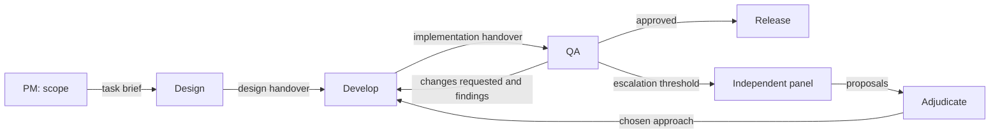

# Database-backed project state, replayable timelines and workflow experiments

Status: proposed specification; no schema migration or runtime cutover has been applied.
Date: 2026-09-13.
Proposed pm-flow project key: `database-workflows`.

## 1. Product objective

Make SQLite the authoritative store for project coordination, record every change
to project state as an ordered transaction, and execute reusable, versioned
workflows whose steps, participants, routing and handovers are data.

Three operator outcomes define the project:

1. **Coordinate without file churn.** Tasks, assignments, handovers, reviews and
   acceptance evidence change through database transactions, not Markdown edits
   and Git commits.
2. **Replay and repeat.** From any checkpoint in a project's history, an operator
   can replay the recorded sequence, or fork the project and repeat it with a
   different agent binding, persona, instruction set, task description, topology
   or policy.
3. **Measure what changed.** Arms forked from one checkpoint run in parallel and
   are compared on speed, input consumption, cost, flow outcomes and independently
   evaluated quality, with exact provenance, replicates and stated uncertainty.

An operator must be able to define `PM → design → develop → QA → release`, the
current CPO/PM/developer/consultant/rescue arrangement, or independent research
panels without implementing another role-specific scheduler. Review, planning,
implementation, adjudication and release are tasks. CPO, PM, designer and developer
are assignments to workflow steps, not database entity types or privileged
branches in the engine. A visual editor can follow through the same public API.

## 2. Observed baseline

These are dated inventories, not live counters.

### pm-flow engine, 2026-09-13

- `store.py` (schema version 1) persists projects, indexed tasks, personas,
  bindings, topologies, attempts, artifacts, outcomes and OpenTelemetry records.
  Attempts have no task revision, prompt revision or source commit fields.
- The scheduler derives operational state from Markdown and text files. Topology
  rows are indexed definitions, not executable workflow revisions. `default`,
  `lean` and `heavy` mostly change bindings and panel size over a fixed hierarchy.
- `export.py::_acceptance_state` treats an acceptance-ID mention as completion,
  including mentions in negative prose. Migration must not import that inference
  as an accepted fact.
- `compare.py` runs exactly two topology arms, one after the other, each over the
  whole project from the current `HEAD`. Binding overlays and persona swaps are its
  only variables. It sums `total_tokens`, derives rescue rate from the literal role
  key `10x_developer`, and assumes a `.agentic/pm_flow` flow directory.
- `agent_exec.sh` records the rendered prompt, but each CLI also receives inputs
  the store never records: auto-loaded repository instruction files, user-level
  settings (Claude isolates them only for scoped roles), a copy of
  `~/.codex/config.toml` with its MCP servers and plugins in every Codex dispatch,
  the `CLAUDE_OUTPUT_STYLE` default and the CLI version. Codex receives `high`
  when `xhigh` or `max` is requested.
- The `knowledge-handover` brief and the project plan require re-running one task
  revision at one base commit with different prompt or binding revisions in
  isolated checkouts, comparing cost, acceptance and evaluation quality with
  provenance and uncertainty. This project owns that requirement (§12).
- The `knowledge-handover` workplan is a scaffold, and a September 6 quarantine
  records repeated provider usage-limit failures. Inbox, tracker and
  workflow-studio depend on that foundation.

### Golden-grid install, 2026-09-13

- 14 project workspaces under `agentic/pm_flow` run an older engine in which roles
  commit in the main tree without linked worktrees. Only `multi-market-rollout`
  dispatched in the preceding 14 days.
- Git is the only project snapshot. Of 246 commits in the preceding 30 days, 74
  touch only flow state and 35 mix flow state with source.
- Past cycles cannot be reproduced. Prompts reference `state.md` (up to 100,671
  bytes) instead of inlining it, and every review overwrites it. No base commit
  is recorded per cycle. Codex runs with `--ephemeral -o` and keeps no usage, so
  32 of 41 developer rows in the project's cost ledger have no amount. Role and
  task template versions are not recorded.
- Agent exploration, not prompt text, dominates input. Across 89 Claude PM
  dispatches the medians are 47 turns, 1,093,809 cache-read tokens, 482 uncached
  input tokens and 26,211 output tokens. Rendered prompts are 5.7–10 KB.
- The Codex developer receives no repository instruction file: the repository has
  no `AGENTS.md`, and Codex does not read `CLAUDE.md`.
- 34 of 109 review verdicts are `NO_GO`. At least one `NO_GO` followed by a pass,
  unattended-scheduler 019 → 020, was caused by shared-tree state (a staged
  `VERSION` file) rather than by output quality.
- Work shares live resources: an IB paper gateway on port 4002 with a fixed client
  ID, a supervisor daemon writing Git-tracked runtime files, Git-ignored SQLite
  files under `data/`, and briefs that require real paper orders.

Relevant existing implementation:

- [Store and telemetry schema](../template/.agentic/pm_flow/store.py)
- [Scheduler](../template/.agentic/pm_flow/driver.zsh)
- [Engine CLI](../template/.agentic/pm_flow/pm_flow.sh)
- [Agent dispatch](../template/.agentic/pm_flow/agent_exec.sh)
- [Catalog and current role edges](../template/.agentic/pm_flow/catalog.py)
- [Topology configuration](../template/.agentic/pm_flow/topology.py)
- [Topology comparison](../template/.agentic/pm_flow/compare.py)
- [Export and acceptance inference](../template/.agentic/pm_flow/export.py)
- [Migration brief](../.agentic/pm_flow/pm-agent/sections/knowledge-handover/brief.md)
- [Workflow-studio brief](../.agentic/pm_flow/pm-agent/sections/workflow-studio/brief.md)

## 3. Scope and fixed decisions

### Required in this project

- Authoritative project/task state, dependencies, assignments, knowledge,
  handovers and explicit acceptance evidence in the existing SQLite store.
- An append-only state transaction log per timeline, with current state as its
  verified projection; checkpoints, forks and replay.
- Durable jobs for every unit of work with side effects: agent, tool and human
  dispatch, evaluation, source integration and telemetry export.
- Immutable task, prompt, environment and published topology revisions with exact
  provenance, including the effective instructions and tools each CLI received.
- An executable graph supporting sequence, branching, bounded loops, fan-out,
  joins, escalation and task decomposition.
- Experiments: typed arm overrides, replicates, parallel isolated execution,
  pinned arm-independent evaluators, defined metrics, uncertainty reporting and
  explicit promotion of a result into production.
- Existing agent adapters, supervision, budgets, isolated worktrees, source
  integration and cost/trace consumers operating through the new state interface.
- A versioned CLI and callable local API; migration, backup, export and rollback.
- Compatibility with unmigrated projects and packaged installation.
- Real provider and OpenTelemetry validation for the changed execution paths,
  including a live experiment.

### Deferred consumers and extensions

- Visual workflow and experiment editing, and trading-research presentation,
  remain consumers of this API. They must not introduce another scheduler,
  experiment runner or accounting store.
- New hosted services, multi-host database coordination and a PostgreSQL service
  are outside this local SQLite cutover.
- New human/task-service transports are optional extensions. The schema
  represents human and deterministic executors; v1 must demonstrate the
  deterministic executor and an explicit persisted human gate without building a
  new UI.
- Live trading and automatic production release are not acceptance scenarios.
- Quality claims extend only as far as an experiment's declared decision rule
  supports (§6). No broader statistical guarantee is in scope.

### Authority and compatibility

Extend the existing store. Do not create a second task database alongside it.
Keep the existing per-project database location during initial cutover; a shared
cross-project store or central discovery index is a separately reviewed change.
Project-local IDs are addressed externally with project/store identity.

For each project, exactly one storage mode is authoritative: legacy files or the
database. After cutover, editable Markdown must not be silently imported at
startup. Temporary bounded dispatch files and explicit exports may remain files.
Operational writes must not require a Git commit; accepted source changes retain
their actual source commits and the driver's ownership/integration rules.

A database-mode project has exactly one production timeline. Only production
transactions change the project's authoritative state or move its integration
branch. Experiment and replay timelines are isolated histories whose results
reach production only through explicit promotion.

Current repository role contracts govern unmigrated projects. Ship coordinated
database-mode guidance and compatibility behavior as part of validated cutover.

## 4. Conceptual model

| Concept | Meaning | Example |
|---|---|---|
| Project | Durable product/work boundary | Golden-grid scheduler |
| Timeline | An ordered state history of one project: production or a fork | Arm `with-agents-md`, replicate 2 |
| State transaction | One atomic, attributable, sequenced change to a timeline | Seq 212: QA published findings and queued rework |
| Checkpoint | A verified timeline position, including source heads | Production seq 200, before development starts |
| Topology | Reusable workflow identity | Software delivery |
| Topology revision | Immutable published workflow | Software delivery v3 |
| Node | A step definition in that revision | QA |
| Seat | A participant definition | QA specialist persona and model binding |
| Task | Stable identity of actual work | Validate the scheduler timeout change |
| Task revision | Immutable requirements for that work | Criteria and scope revision 2 |
| Workflow run | An invocation of a pinned workflow on a root task in a timeline | Deliver that change at a base commit |
| Execution | One activation of one node for one task revision | QA's first evaluation of implementation v2 |
| Job | A durable, leased, idempotent unit of work to perform | Dispatch execution E102 |
| Attempt | One actual worker/agent invocation for a job | Retry after an interrupted provider call |
| Environment revision | What an invocation effectively received besides its inputs | CLI version, model, effort, instruction slots, tools |
| Output | An attributed immutable published artifact | QA findings and handover |
| Input | Exact artifact/output supplied to an execution | The developer handover QA actually evaluated |
| Experiment | A hypothesis tested by forking arms from one checkpoint | Does a repository instruction file reduce rework? |
| Arm | A named set of typed overrides; the baseline has none | `with-agents-md` |
| Evaluation | An arm-independent measurement of a replicate's result | Drill test at the produced commit |

One participant may perform several nodes: a PM can scope and later review.
One node may have multiple participants: a panel instantiates one execution per
responsible panel member. Accountability and consultation do not implicitly
launch extra workers; executable consultation is an explicit task.

An execution is business progress; a job is the operational work that advances
it. An `execute_node` job dispatches an execution, while evaluation, source
integration and telemetry export are jobs with no execution of their own.

A task is independent of topology, model and timeline. The same task revision and
source commit can be executed in separate timelines with different workflows,
bindings or instructions.

Derived tasks follow one mechanical rule. A node whose contract declares a derived
task, such as review, adjudication or release, creates at most one child task per
subject task, keyed `<subject-task-key>/<node-key>`, on its first activation for
that subject. Rework and re-review are further executions of the existing tasks
with new pinned inputs; a reviewer invocation is never another attempt of the
implementation task. A requirement change creates a new subject task revision,
and the derived task gains a revision that references it. Task key, node key and
iteration align the same work across timelines.

Project-level coordination, including portfolio review, is a workflow run rooted
at the project's root task; no execution exists outside a workflow run. Existing
`runs` rows remain scheduler sessions: one driver process and one trace root,
leasing jobs from any workflow run in its timeline.

A timeline's state is its transaction log. A fork starts from a checkpoint and
then evolves independently of its parent. The difference between two arms is
exactly the override transactions each applies after forking.

## 5. Relational schema proposal

This is a logical schema, not executable DDL. Implementation must produce a
versioned migration with concrete constraints, indexes and compatibility views.
Existing tables are extended or migrated rather than duplicated wholesale.

Notation: `id` is a primary key; `*_id` is a foreign key unless explicitly marked
as an external identifier; `?` denotes nullable; JSON is validated SQLite TEXT.
Use INTEGER for local IDs/counters/booleans, TEXT for keys, hashes, states and
payloads, and the existing REAL UTC timestamp convention. Retain current IDs
where possible. No new role names or outcome vocabularies are hard-coded enums
in the engine schema. Lifecycle states, job kinds, override operations and
executor primitives are constrained.

All historical records have creation timestamps. Mutable current-state rows also
have `updated_at`, an integer `version` for compare-and-swap updates, and the
`updated_txn_id` of the transaction that last changed them. Current-state rows
belong to one timeline, directly or through their workflow run. Immutable content
(artifacts, environment revisions, personas, bindings, topology revisions) is
shared across timelines. Tables below omit repetitive timestamp fields.

### 5.1 State transactions, timelines and jobs

| Table | Columns | Responsibility |
|---|---|---|
| `timelines` | `id, project_id, key, purpose, parent_timeline_id?, fork_seq?, fork_checkpoint_id?, experiment_arm_id?, replicate?, side_effect_policy_json, status, head_seq, version` | History identity. `purpose` is `production`, `experiment` or `replay`. |
| `state_transactions` | `id, timeline_id, seq, actor_id, job_id?, idempotency_key, request_hash, projection_hash, committed_at` | Append-only and contiguous per timeline; one row per committed state-service mutation. |
| `state_changes` | `id, transaction_id, ordinal, operation, operation_version, entity_kind, entity_id, payload_json` | Typed operations applied by the versioned reducer: lifecycle changes, routing, revision creation, decisions and recovery. |
| `checkpoints` | `id, timeline_id, seq, key?, reason, projection_hash, snapshot_artifact_id?, source_heads_json, replayable, replay_limits_json` | Verified addressable positions, with an optional materialized projection for fast forks. |
| `timeline_sources` | `timeline_id, repository, ref_name, head_commit, updated_txn_id` | Source head per repository per timeline, in a timeline-scoped ref namespace. |
| `jobs` | `id, timeline_id, workflow_run_id?, kind, subject_kind, subject_id, state, priority, not_before?, idempotency_key, input_fingerprint, lease_owner?, lease_until?, fencing_epoch, attempt_count, max_attempts, reuse_of_job_id?, created_txn_id, completed_txn_id?` | Claimable work with leases, retries and stale-worker protection. A timeline's jobs, ordered by creating transaction, are its replayable sequence. |

Required uniqueness: `(project_id, key)` on timelines; one `production` timeline
per project through a partial unique index; `(experiment_arm_id, replicate)` on
timelines; `(timeline_id, seq)` and `(timeline_id, idempotency_key)` on
transactions; `(transaction_id, ordinal)` on changes; `(timeline_id,
idempotency_key)` on jobs.

- Every authoritative mutation is a state-service call that, in one SQLite
  transaction, appends a transaction with its changes, updates projection rows
  and stores the resulting `projection_hash`. No projection row changes without a
  transaction.
- The reducer is deterministic and versioned. Re-applying a timeline's changes
  from its fork base reproduces the stored projection hash at every checkpoint.
  An unknown operation version is an error, never a skip.
- Every committed sequence number is a valid fork position. Checkpoints are
  created at each accepted source integration, at experiment creation and on
  operator request. A snapshot artifact is verified against the log before use.
- A fork materializes the parent projection as of the fork position into the
  child timeline, creates timeline-scoped source refs at the checkpoint's heads,
  and records both in the child's first transaction. It never reads through to
  the parent afterwards. Jobs leased at the fork position are queued in the child
  without their leases; in-flight attempts are not copied.
- Job kinds are `execute_node`, `evaluate`, `integrate_source`,
  `dispatch_external`, `export_telemetry` and `materialize_fork`. Job states are
  `queued`, `leased`, `waiting`, `succeeded`, `failed`, `cancelled` and `dead`.
- `fencing_epoch` lives on the job and only increases. Leasing increments it;
  completion carrying an older epoch is rejected.
- `input_fingerprint` hashes the task revision, node contract, environment
  revision, pinned input artifact identities, base commit per repository and
  resolved binding. Equal fingerprints mean equal declared inputs, not equal
  results.
- A checkpoint is not replayable when its history contains imported work whose
  dispatch inputs were not captured. `replay_limits_json` names what is missing.

### 5.2 Workflow definitions

| Table | Columns | Responsibility |
|---|---|---|
| `topologies` | `id, key, name, description, archived_at?` | Stable workflow identity; retain existing identities during migration. |
| `topology_revisions` | `id, topology_id, revision, derived_from_revision_id?, content_hash, schema_version, publication_state, published_at?` | Draft editing and immutable published snapshots; derivation makes variant diffs explicit. |
| `topology_nodes` | `id, topology_revision_id, key, name, executor_kind, contract_json, policy_json, child_topology_revision_id?` | Task-step instructions, derived-task declaration, validation and execution policy. Child revision is required only for a subworkflow node. |
| `topology_seats` | `id, topology_revision_id, key, principal_id?, persona_revision_id?, binding_id?` | Workflow participant defaults; resolve agent personas/bindings separately from node contracts. |
| `node_assignments` | `node_id, seat_id, relationship` | Responsible, accountable, consulted or informed relationships. |
| `node_ports` | `id, node_id, direction, name, schema_json, required, cardinality` | Named input/output contracts, including scalar and collection ports. |
| `topology_transitions` | `id, topology_revision_id, key, from_node_id, to_node_id, trigger, condition_json, policy_json` | Eligibility, conditional routing, bounded looping, fan-out and join policy. |
| `topology_data_links` | `id, transition_id, from_port_id, to_port_id` | Maps producer outputs into consumer input ports. |

Required uniqueness: `(topology_id, revision)`, `(topology_revision_id, key)` on
nodes/seats/transitions, `(node_id, direction, name)` on ports, and unique
assignment/data-link tuples. All node, seat, transition and port relationships
must stay inside the same revision. Enforce this through composite foreign keys
where practical and transactional validation where graph-level rules are needed.

`executor_kind` supports `agent`, `tool`, `human` and `subworkflow`. It identifies
an execution primitive, not a business role. Tool identifiers resolve through a
registered adapter and access policy, not arbitrary executable code in JSON.

Published revisions and their child rows are immutable. Editing creates a new
revision; active workflow runs continue on the old one. Starting work requires a
published, validated revision. Transparent mid-run topology mutation is
prohibited.

### 5.3 Project work and execution

| Table | Columns | Responsibility |
|---|---|---|
| `projects` | `id, key, name, repository_uri, status, storage_mode, production_timeline_id?, version` | Project identity, lifecycle and selected state authority. |
| `project_revisions` | `id, project_id, timeline_id, revision, objective, policy_json, content_hash, created_txn_id` | Versioned objective, constraints and governance per timeline; a `policy.set` override creates one in its arm. |
| `tasks` | `id, project_id, origin_timeline_id, key, parent_task_id?, derived_from_node_key?, created_txn_id` | Durable work identity. Tasks created after a fork belong to that fork. |
| `task_states` | `timeline_id, task_id, task_key, current_revision_id, status, priority, version, updated_txn_id` | Current lifecycle of each task visible in a timeline. |
| `task_revisions` | `id, task_id, timeline_id, revision, parent_revision_id?, title, objective, contract_json, content_hash, created_txn_id` | Immutable requirements, writable scope and acceptance contract. Revision numbers are assigned per timeline. |
| `task_dependencies` | `timeline_id, task_id, depends_on_id, condition_json, updated_txn_id` | Project-level dependency requirements per timeline; extend the existing table. |
| `workflow_runs` | `id, timeline_id, project_revision_id, topology_revision_id, root_task_revision_id, parent_execution_id?, base_commits_json, status, trace_id, version` | Pinned workflow invocation; an optional parent execution anchors a subworkflow. |
| `task_executions` | `id, workflow_run_id, node_id, task_revision_id, parent_execution_id?, iteration, member_key?, alignment_key, status, outcome_code?, activation_key, version` | One activation, including rework and fan-out members. |
| `execution_dependencies` | `execution_id, prerequisite_execution_id, required_outcome?` | Concrete prerequisites selected for this run and iteration. |
| `execution_assignments` | `id, execution_id, seat_id, relationship, principal_id?, resolved_binding_id?` | Actual participants and immutable dispatch-time overrides. |

Existing `runs` rows become scheduler sessions and gain `timeline_id`.

Retain source commits as repository-qualified references; a null commit means
unavailable or non-source work, not an invented value. Worktree/checkout location
is operational metadata and must not substitute for source identity.

Required uniqueness includes `(project_id, origin_timeline_id, key)` on tasks,
`(timeline_id, task_id)` and `(timeline_id, task_key)` on task states,
`(task_id, timeline_id, revision)` on task revisions,
`(project_id, timeline_id, revision)` on project revisions, and
`(workflow_run_id, activation_key)` on executions. `alignment_key` is
`<task-key>/<node-key>#<iteration>`, suffixed with the member key for fan-out
members. Parent tasks and task dependencies cannot cross project boundaries or
form cycles within a timeline. Execution references must agree on timeline,
workflow run and pinned topology revision. The explicit
`workflow_runs.parent_execution_id` subworkflow link is the exception to same-run
scope: it references the parent run's invoking execution in the same timeline and
must match that node's pinned child topology revision. Parent links cannot form
cycles.

Task completion is a policy-controlled business state, not a synonym for a
successful invocation. A node execution can succeed while its outcome requests
changes to the subject task. Task state changes and their transaction are
written together.

### 5.4 Attempts, environments, knowledge and handovers

| Table | Columns | Responsibility |
|---|---|---|
| `principals` | `id, key, kind, display_name` | Attributable human, configured agent identity or system actor; authentication remains the transport's responsibility. |
| `prompt_revisions` | `id, content_hash, artifact_id?, composition_json, capture_policy` | Exact rendered prompt identity and independently versioned persona composition. |
| `environment_revisions` | `id, content_hash, cli, cli_version, model_requested, model_effective?, effort_requested, effort_effective, params_json, instruction_slots_json, tool_manifest_artifact_id, isolation_json` | The effective invocation environment; one row per distinct combination. |
| `attempts` | existing columns plus `job_id, execution_id?, prompt_revision_id?, environment_revision_id?, execution_assignment_id?, base_commit?, produced_commit?, fencing_epoch?, turns?, api_duration_s?, queue_wait_s?, throttled_s?, cost_basis?, price_revision_id?` | One invocation, its resolved agent/CLI/model/effort, timestamps, usage, cost and trace identity. `cost_basis` is `reported`, `estimated` or `unknown`. New-mode dispatch requires provenance; historical unknowns stay null. |
| `attempt_reads` | `attempt_id, source_kind, locator, content_hash?, bytes?, first_read_at` | What an agent actually consumed through tools or the context interface. |
| `artifacts` | existing columns plus `schema_key?, schema_version?, storage_uri?` | Immutable content-addressed handovers, evidence, designs and results. |
| `task_outputs` | `id, execution_id, attempt_id?, port_id, artifact_id, item_key, published_at` | Attributes each published output to its producer. Human/system output still has an attributed transaction. |
| `task_inputs` | `id, execution_id, port_id, source_output_id?, external_artifact_id?, item_key` | Pins exact consumed inputs; exactly one source reference must be set. |

`instruction_slots_json` maps a versioned slot vocabulary to content hashes and
artifact references: `cli_builtin` (identified by CLI and version, since its
content is not capturable), `user_config`, `repo_instructions`, `flow_contract`,
`persona_layers`, `node_contract`, `task_contract`, `context_manifest` and
`output_style`. An absent slot is recorded as absent, not omitted.

Dispatch isolation makes that record true. Each attempt runs with a run-scoped
CLI configuration home seeded only from declared `user_config` content and the
required credentials. Auto-loaded repository instruction files are hashed from
the worktree the attempt ran in. The tool manifest lists the MCP servers,
plugins, hooks and tool grants the CLI was given. When an adapter translates a
value, such as a Codex effort ceiling, the effective value is recorded beside the
requested one.

Existing `personas`, `bindings` and persona composition remain reusable. A
`persona_revision_id` resolves to the existing immutable content-versioned persona
row; do not create a second persona catalog. Prompt identity, environment
identity, pinned inputs and attempt reads are all necessary to reproduce what an
invocation received.

When raw prompt capture is disabled, retain the hash, composition and provenance
but leave the raw artifact absent; report limits on exact content replay. Do not
claim both content-free storage and guaranteed reconstruction of unavailable text.

Internal artifacts are content-addressed and durable. Large content may reside in
a managed artifact directory with a digest and database reference. A mutable URL
alone is insufficient evidence; snapshot it or record its external identity,
retrieval time and explicit reproducibility limits. Code is referenced by
repository and commit. Deduplication must not bypass task-scoped access checks.
Artifacts referenced by a checkpoint, experiment or evaluation are retained.

An attempt's raw transcript is not a published handover. Only validated declared
outputs are available through data links. Published input bindings are frozen
before dispatch. No consumer resolves a moving `latest` output while running.

### 5.5 Acceptance and evidence

| Table | Columns | Responsibility |
|---|---|---|
| `acceptance_criteria` | `id, task_revision_id, key, requirement, validation_contract_json` | Explicit criterion identity for one task revision. |
| `criterion_assessments` | `id, criterion_id, subject_output_id, assessing_execution_id, decision, rationale_artifact_id?, supersedes_id?` | An immutable attributable assessment of a specific produced output. |
| `assessment_evidence` | `assessment_id, artifact_id` | Evidence supporting the assessment. |

Decisions are `met`, `unmet` or `unresolved`. The assessment's authority comes from
the assessing task's assignment and pinned policy; any arbitrary task cannot
approve release. Multiple assessments remain visible. The gate policy determines
how authorized assessments combine, including disagreement, invalidation and
supersession. Never use an unconditional latest-row-wins rule.

Assessment publication verifies the subject output, criterion revision and actual
review inputs agree. A changed task contract is not satisfied automatically by
older passing evidence. Reuse requires an explicit attributable decision.

There is no special review execution table. Review agents, automated test tasks
and human gates can all produce assessments through the same interface.

### 5.6 Experiments and evaluation

| Table | Columns | Responsibility |
|---|---|---|
| `experiments` | `id, project_id, key, hypothesis, checkpoint_id, stop_condition_json, replicates, max_parallel, schedule_seed, budget_json, primary_metrics_json, decision_rule_json, status, version, created_txn_id` | Pinned comparison design; only `status` changes after start. |
| `experiment_arms` | `id, experiment_id, key, is_baseline, overrides_json, overrides_hash, reuse_policy` | Typed overrides; exactly one baseline, with no overrides. |
| `evaluator_revisions` | `id, key, kind, content_hash, config_json, persona_revision_id?, binding_id?` | Immutable test, judge, metric or human evaluation definitions. |
| `experiment_evaluators` | `experiment_id, evaluator_revision_id, subject_selector_json, criteria_source, blind` | Evaluators applied identically to every replicate. |
| `price_revisions` | `id, provider, model, content_hash, rates_json, effective_from` | Versioned rates for estimated cost where a provider reports none. |

Experiment timelines are `timelines` rows carrying `experiment_arm_id` and
`replicate`. Evaluation results are `outcomes` rows extended with `timeline_id`,
`evaluator_revision_id`, `job_id` and a subject output or commit reference, so
the store keeps one measurement table.

Overrides use a versioned vocabulary. Each one names its target and is applied as
a transaction in the arm's timeline immediately after the fork.

| Operation | Target | Effect |
|---|---|---|
| `task.revise` | Task key | New task revision with a changed title, objective, contract or criteria |
| `seat.binding` | Seat key, optionally node key | Different CLI, model, effort or tool grants |
| `seat.personas` | Seat key | Different ordered persona stack |
| `instruction.slot` | Slot, optionally seat or node key | Replaced or removed content for one instruction slot |
| `topology.revision` | Root task | Different published topology revision for new workflow runs |
| `policy.set` | Policy path | Budget, loop bound, escalation threshold, handover cap or join policy |

Reuse policy `none` executes every job afresh. `identical_inputs` reuses a
recorded result from the source timeline only for a job whose alignment key and
input fingerprint both match, marks the job with `reuse_of_job_id`, and excludes
its usage from the arm's measured totals.

### 5.7 Durable routing and migration support

| Table | Columns | Responsibility |
|---|---|---|
| `execution_groups` | `id, workflow_run_id, parent_execution_id?, key, join_policy_json, membership_closed, status, version` | Fan-out/panel identity and persisted join state. |
| `execution_group_members` | `group_id, execution_id, member_key` | Exact expected members; required to distinguish missing and unfinished results. |
| `transition_firings` | `id, workflow_run_id, transition_id, source_execution_id?, group_id?, firing_key, target_execution_id` | Unique routing decisions preventing duplicate downstream activation after restart. |
| `migration_batches` | `id, project_id, source_format, source_fingerprint, backup_uri, backup_hash, status, report_artifact_id?` | Recoverable migration history and source snapshot identity. |
| `legacy_identity_map` | `migration_batch_id, source_kind, source_key, target_kind, target_id, confidence, issue_artifact_id?` | Auditable mapping of legacy tasks, cycles and evidence; no invented provenance. |

Polymorphic legacy target references require explicit validation by the importer.
They are migration bookkeeping, never scheduler foreign keys. A verified source
identity remains unique across repeated imports of the same project snapshot.

Existing usage fields, `outcomes`, `spans` and `span_events` remain the accounting
and telemetry authority. Preserve exporter recovery semantics. Work sent to an
external human or tool service is a `dispatch_external` job created in the
scheduling transaction and dispatched with its idempotency key. Do not promise
atomicity between SQLite and an external provider, Git operation or release
service.

## 6. Execution, replay and experiment rules

### Lifecycle and transaction boundaries

Execution states are `pending`, `ready`, `running`, `waiting`, `succeeded`,
`failed`, `cancelled` and `blocked`. A structured `outcome_code` such as
`approved`, `changes_requested` or `abandon` is independent of lifecycle state.
Allowed transitions are validated by the state service; agents cannot write SQL.

1. A state transaction creates an execution, its frozen input bindings and an
   `execute_node` job with its input fingerprint.
2. A worker leases the job atomically, incrementing its fencing epoch.
3. Resolve the environment revision, record an attempt and dispatch outside the
   database transaction.
4. Validate returned outputs, attribution, schemas and the fencing epoch.
5. In one state transaction, publish outputs/assessments, complete the job and
   execution, record transition firings, and create eligible downstream
   executions and jobs.
6. Resume by querying timelines, jobs and projections; do not reconstruct
   progress from transcripts.

Use foreign keys, short transactions, a busy timeout and optimistic version checks.
Validate journal/locking configuration on the supported local filesystem. Workers
must not hold transactions during model calls or source integration.

An expired worker cannot publish after another worker leases the job. An agent
crash may cause invocation retry; the guarantee is one accepted publication and
one durable routing effect per key, not exactly-once external execution. All
actual attempts, including interrupted/rejected ones, retain their usage.

Source integration is an `integrate_source` job. Its creating transaction records
intent; the worker performs the Git operation; the completing transaction records
the actual resulting commit. Recovery checks whether integration already occurred
before attempting it again. Source-dependent downstream work waits for that job.
Only the production timeline integrates into the project's integration branch;
every other timeline integrates into its own refs.

### Control flow versus data flow

A transition says when the next step is eligible. A data link says what it reads.
Example condition, expressed through a versioned restricted expression vocabulary:

```json
{
  "field": "outputs.decision.verdict",
  "operator": "eq",
  "value": "changes_requested"
}
```

No `eval`, embedded SQL or arbitrary code execution. Define deterministic behavior
for missing fields, multiple matching routes and no matching route. Conditional
alternatives must be exclusive or explicitly marked as fan-out. Evaluation and
the selected branch are recorded. Input ports can also receive earlier upstream
outputs such as the original brief through explicit dependencies/data bindings.

### Rework, retries and escalation

- A transport retry creates another attempt of the same job.
- A rejected implementation followed by rework creates a new execution with
  pinned feedback inputs; a requirement change creates a new task revision too.
- Escalation counts substantive outcomes according to declared policy, separately
  from transport failures, and names the counter scope and reset condition.
- Every loop has an iteration, elapsed-time or cost bound and a declared terminal
  or escalation path. Existing project/section budgets continue to apply.
- Template graphs may contain bounded loops. Concrete execution prerequisites
  remain acyclic because iterations create new execution identities.

### Panels and joins

Fan-out creates one execution per member with the same briefing artifact. Members
cannot read peers' unpublished work or raw conversations. Adjudication is another
task consuming explicitly published proposals.

Persist expected membership before evaluating a join. Support `all`, `quorum`
and deadline policies. A deadline records missing responses; it does not convert
them into approval. Membership and selected proposal inputs are frozen when the
join fires. Late outputs remain attributable history and do not silently mutate
an adjudication already dispatched. Cancellation policy for remaining members is
explicit. Replaying completion events must not launch duplicate adjudication.

### Dynamic decomposition and subworkflows

A planning task can publish a validated expansion proposal. The state service
creates child tasks, revisions and dependencies transactionally in the planning
task's timeline, recording the creating execution and applying project ownership,
budget and access constraints. Five implementation tasks can use the same
development node with five activation keys; they do not require five copies of a
topology definition.

Scope expansion is a typed operation governed by policy, not unrestricted writes
to the graph. Subworkflow nodes pin a child topology revision and connect parent
and child workflow runs/executions through explicit inputs and outputs. Recursion
is bounded. Children cannot self-assign broader access than their parent run
permits.

### Replay

Replay runs on a new `replay` timeline forked from a checkpoint, in one of three
modes:

- `verify` executes no jobs. It re-applies the source log through the reducer and
  compares projection hashes at every checkpoint and at the head.
- `recorded` re-runs routing with recorded job results. A job whose alignment key
  and input fingerprint match its source counterpart publishes the recorded
  outputs without invoking a worker. Replay stops at the first divergent job and
  reports its position, the differing fingerprint components and the routing
  decision that led there. It makes no model calls.
- `execute` dispatches every job after the fork afresh under the replay
  timeline's definitions.

`recorded` makes routing and policy changes testable without model spend.
`execute` repeats the work itself; an experiment replicate is an `execute`
timeline with its arm's overrides applied.

### Experiments

- **Validation.** An experiment pins a checkpoint, arms, replicates, evaluators,
  stop condition, budget, metrics and decision rule. Before any timeline,
  worktree or job exists, validation resolves every override target at the
  checkpoint. It rejects an unknown target, two overrides of one target in one
  arm, an unpublished topology revision, an unavailable binding or model, and a
  missing baseline. A model is never silently substituted.
- **Stop conditions.** `tasks_accepted` (named task keys), `timeline_idle`,
  `max_jobs`, `source_seq` (the aligned position of a source-timeline sequence),
  `deadline` and `budget`, combinable with `any`/`all`. Budgets accept token
  limits for bindings whose cost is unknown. Each replicate records its stop
  reason.
- **Scheduling.** Replicates of all arms start interleaved in an order derived
  from the recorded seed, bounded by `max_parallel` and budgets. Rate-limit and
  usage-limit events are recorded per attempt. A replicate paused by a provider
  quarantine resumes; it is not counted as failed.
- **Isolation.** Each replicate has its own timeline, worktrees, timeline-scoped
  refs, CLI configuration homes and allocated resources (ports, client IDs, data
  directories) as declared by project policy. Replicates cannot read each other's
  worktrees, unpublished outputs or configuration homes.
- **Side effects.** Non-production timelines deny credentials and network
  destinations their side-effect policy does not allow. Brokerage, deployment,
  release and outbound messaging are denied by default. A human gate in a
  non-production timeline resolves through a declared deterministic stand-in or
  stays waiting with the gap recorded; it reaches people only when the experiment
  explicitly allows it.
- **Environment drift.** Replicates of all arms share environment revisions
  except in the slots and fields an arm's overrides name. Any other difference,
  such as a CLI upgrade between replicates or an edited user configuration, marks
  the affected comparison `confounded`, and the report names the field.
- **Evaluation.** Evaluators run as `evaluate` jobs after a replicate stops,
  identically for every replicate, against its published outputs or produced
  commits. By default they judge against the criteria pinned at the checkpoint,
  so an arm that revises a task cannot change what it is measured against. A
  blind evaluator receives no arm key, override content or timeline identity.
  Evaluator usage is reported separately from arm cost. Assessments made by a
  replicate's own nodes are process metrics, never the experiment's quality
  measure.
- **Metrics.** Recorded per attempt and aggregated per replicate and arm:
  - input: uncached input, cache-write and cache-read tokens, each reported
    separately; output and reasoning tokens; turns; bytes read;
  - time: wall time from the replicate's first job to its stop, queue wait,
    active attempt time, provider API time where reported, and throttled time;
  - cost: reported, estimated with its price revision, and the count of attempts
    with unknown cost, which is never coerced to zero;
  - flow: jobs, executions per node key, rework iterations, rejection outcomes,
    escalations and subworkflow activations by node key, cycles to acceptance,
    stop reason;
  - quality: evaluator results.

  Overlapping token categories are never summed into one figure.
- **Report and decision.** Per arm, the report shows sample count, median, mean,
  dispersion and 95% intervals (Wilson for proportions, seeded bootstrap for
  continuous metrics), plus the difference from baseline with its interval. The
  declared decision rule yields `better`, `worse`, `no_detectable_difference` or
  `inconclusive`; below the rule's sample minimum the result is `inconclusive`.
  The report records start order, concurrency overlap, rate-limit events,
  cache-read share and environment revisions per arm, and never ranks quality
  without evaluator evidence.
- **Promotion.** Promoting a replicate appends production transactions that
  reference its outputs and produced commits, re-assesses them under production
  acceptance authority, and integrates source through a production
  `integrate_source` job. If production changed the same tasks or source paths
  after the checkpoint, promotion is refused with the conflicts listed.
  Unpromoted experiments change nothing in production.

## 7. Handover contract, example workflow and experiment

Handovers are immutable validated artifacts, capped at 500 words and 8192 bytes.
They reference larger evidence rather than embedding it. Authorship, task and
attempt identity are relational provenance, not unverified self-description.

```json
{
  "summary": "Implemented bounded termination of hung scheduler sends.",
  "deliverables": [
    {"type": "git_commit", "repository": "project-repository", "sha": "<commit-sha>"}
  ],
  "evidence": [{"artifact_id": 812}],
  "decisions": ["Terminate first; kill after the grace period."],
  "unproven": ["Behaviour against the live gateway"],
  "requested_action": "Evaluate the implementation against the task criteria."
}
```

The reviewer receives this handover plus authorized access to referenced work and
evidence. It must verify claims, not merely assess the previous agent's summary.



| Node | Inputs | Outputs | Assignment |
|---|---|---|---|
| Scope | Product request | Brief, criteria, expansion proposal if needed | PM |
| Design | Brief, constraints | Design handover | Designer |
| Develop | Brief, design, optional QA findings | Implementation handover, evidence | Developer |
| QA | Brief, exact implementation handover, evidence | Assessments, findings, decision, handover | QA agent |
| Panel | Bounded failure brief and evidence | Independent proposals | One execution per consultant |
| Adjudicate | Brief and selected panel outputs | Chosen approach or stop decision | CPO or another configured seat |
| Release | Approved implementation and QA output | Release result, handover | Release executor or human gate |

Example recorded lineage on the production timeline, where checkpoint seq 200 is
taken when E101's job is queued:

| Seq | Execution | Task | Consumes | Publishes | Outcome |
|---|---|---|---|---|---|
| 204 | E101 | `timeout-change` revision 1 | Design output O80 | Handover O101 | delivered |
| 212 | E102 | `timeout-change/qa` revision 1 | O101 and evidence | Findings O102 | changes_requested |
| 219 | E103 | `timeout-change` revision 1 | O80 and O102 | Handover O103 | delivered |
| 226 | E104 | `timeout-change/qa` revision 1 | O103 and evidence | Assessment O104 | approved |
| 231 | E105 | `timeout-change/release` revision 1 | O103 and O104 | Release record O105 | released |

E103 reuses the implementation task revision because requirements did not change;
its execution inputs did. E102 and E104 are two executions of one derived review
task, aligned as `timeout-change/qa#1` and `timeout-change/qa#2`. E104 targets
O103; O104 never implicitly approves O101 or a later changed commit.

Example experiment forked from that checkpoint:

```json
{
  "key": "developer-instructions",
  "hypothesis": "A repository instruction file reduces developer rework without raising input.",
  "checkpoint": {"timeline": "production", "seq": 200},
  "replicates": 3,
  "max_parallel": 6,
  "stop_condition": {"any": [{"tasks_accepted": ["timeout-change"]}, {"budget_usd": 30}]},
  "arms": [
    {"key": "baseline", "baseline": true, "overrides": []},
    {"key": "with-agents-md", "overrides": [
      {"op": "instruction.slot", "slot": "repo_instructions", "seat": "developer", "artifact": "sha256:<digest>"}
    ]},
    {"key": "sonnet-developer", "overrides": [
      {"op": "seat.binding", "seat": "developer", "binding": "claude-sonnet-5-high"}
    ]},
    {"key": "tighter-brief", "overrides": [
      {"op": "task.revise", "task": "timeout-change", "contract": "sha256:<digest>"}
    ]}
  ],
  "evaluators": [
    {"key": "drill-case-c", "kind": "test", "subject": "produced_commit", "blind": true},
    {"key": "criteria-judge", "kind": "judge", "revision": 2, "subject": "final_outputs", "criteria": "checkpoint", "blind": true}
  ],
  "primary_metrics": ["quality.drill-case-c.pass", "flow.rework_iterations", "input.cache_read_tokens", "time.wall_s"],
  "decision_rule": {"metric": "quality.drill-case-c.pass", "min_samples_per_arm": 3, "interval": 0.95}
}
```

Twelve replicate timelines start interleaved. In each, the arm's override is the
first transaction after the fork. `tighter-brief` is still judged against the
checkpoint's criteria.

## 8. Public interface and observability

Provide one versioned callable state service used by the scheduler, CLI, MCP,
export and future UI. Direct SQL is an implementation detail. Mutations accept
an actor, timeline, scope, idempotency key and expected version where applicable.
Responses return stable IDs, sequence/revision/version and structured errors:
conflict, invalid reference, invalid contract, unmet dependency, lost lease,
denied scope, denied side effect, non-replayable checkpoint or confounded
comparison.

Operations must cover:

- Draft, validate, publish and retrieve topology revisions.
- Create/revise projects and tasks; propose/apply decomposition.
- Set assignments/dependencies; query eligibility and bounded task context.
- Lease/heartbeat jobs; start/finish attempts; publish declared outputs.
- Record assessments; resolve gates; retrieve input/output lineage.
- Inspect/retry/cancel/resume jobs and executions through legal transitions.
- Read a timeline's transaction log and its projection as of any sequence.
- Create, list and verify checkpoints; fork; replay in `verify`, `recorded` and
  `execute` modes.
- Create, validate, start, pause, resume, cancel, diff, report and promote
  experiments; inspect environment revisions and attempt reads.
- Dry-run/apply migration, backup, export and rollback.

Proposed namespaces: `pm-flow knowledge ...` for state and migration,
`pm-flow workflow ...` for workflow definitions, `pm-flow timeline ...` for
checkpoints, forks and replay, and `pm-flow experiment ...` for experiments.
`pm-flow compare` remains as an adapter that creates and reports a two-arm
experiment. Exact subcommands and request schemas are finalized with
implementation; none are available commands today. Existing
status/export/cost/trace/compare interfaces must remain usable through documented
adapters and versioned output where semantics change.

Every new-mode attempt links its timeline, job, task revision, topology
revision/node, execution, agent assignment, prompt revision, environment revision
and source base, plus experiment, arm and replicate in experiment timelines.
Spans carry the same identities as attributes, so one backend query can group
traces by arm. Preserve existing provider-reported input/output/cache/reasoning
fields and their semantics; missing usage remains unknown. Do not sum overlapping
token categories or count cumulative provider events twice. Repeat exports do not
add billing records.

Live validation must correlate stored usage and provider output with inspectable
OpenTelemetry traces, including failure, rejection, retries, interruption/resume,
concurrent branches, parallel experiment replicates and exporter outage. Disabled
prompt capture still records identity/provenance. Credentials and disallowed raw
content stay absent. Existing unknown historical costs/end times/provenance
remain unknown.

## 9. Migration and rollout

1. Inventory every project format, state file, cycle, evidence record and existing
   database. Detect projects without section registries and report their treatment.
2. Take a coherent snapshot using the database backup interface plus a manifest of
   project/artifact files. Quiesce the driver or verify it cannot change the source
   during apply. A running golden-grid project must not be imported from a moving
   filesystem and declared migrated.
3. Dry-run parsing and identity mapping. Report contradictions, unsupported
   records and unknown provenance. Preserve original evidence text/content hashes.
4. Import into a staging transaction/store using the existing schema lineage.
   Imported history becomes the production timeline's first transactions,
   attributed to a `legacy-import` principal in recorded time order. Explicit
   legacy decisions, such as review verdict files and section status files,
   become execution outcome codes and task states with the decision file as
   evidence. Acceptance criteria stay `unresolved` unless an explicit assessment
   exists. Validate counts, foreign keys, task/cycle/evidence mappings and usage
   totals.
5. Mark checkpoints covering imported cycles whose dispatch inputs were
   overwritten as not replayable, naming the missing inputs. The cutover
   checkpoint is the first fully replayable one.
6. Re-run import and simulate interruption. Demonstrate idempotence and recovery
   before changing authority. No status/cost/acceptance inference fills gaps.
7. At the safe boundary, select database mode atomically and start the compatible
   packaged runtime. Legacy engines must fail with a clear incompatibility
   diagnostic instead of writing stale files after cutover.
8. Verify a review, handover and fresh process continue correctly without changing
   tracked-file status or Git HEAD. Verify accepted source integration separately.
9. Keep legacy material as a read-only migration archive or explicit export.
   Remove tracked operational files only through a deliberate archival change,
   preserving history and rollback evidence; this is not a prerequisite to proving
   zero operational Git churn.

Rollback before new database-mode work restores the verified snapshot and authority
mode. After new work, restoring the old snapshot alone would lose evidence:
produce and verify a compatible export of subsequent state, or refuse destructive
rollback with a precise incompatibility report. Never label stale restoration as
lossless rollback. Backup and restore include managed artifact content.

Test first against disposable representative fixtures, then a coherent golden-grid
snapshot, then a real target at a driver boundary. Package-layout migration and
state-authority migration are distinct steps; neither proves the other.
Golden-grid's package-layout and engine migration precede its state migration.

## 10. Acceptance criteria

All IDs are stable. Commands named below are proposed test entry points to be
implemented, not claims of tests already available or passing.

### State, execution and migration

| ID | Observable outcome and validation |
|---|---|
| A1 | Migration dry-run/apply preserves task, cycle, artifact and available attribution identities; repeat apply creates no duplicates. Imported explicit verdicts appear as attributed outcome codes, and imported cycles without captured inputs are marked not replayable. `tests/knowledge_migration_test.sh` covers legacy variants, ambiguity, interrupted apply and verified backup/rollback. |
| A2 | Assignment, review/assessment and handover updates survive fresh processes with identical Git HEAD and tracked-file status. `tests/knowledge_state_test.sh` verifies database authority and that editing a projection changes nothing. |
| A3 | Invalid references, cross-project access, cyclic concrete dependencies and stale updates are rejected. Competing workers leasing one job produce one accepted completion; a worker with an older fencing epoch cannot complete; a crash between the Git operation and completion of an `integrate_source` job recovers without a second merge. `tests/knowledge_state_test.sh` uses multiple processes. |
| A4 | Negative prose mentioning A1 remains unresolved/unmet. Authorized assessment of the correct output can satisfy the criterion; old-revision evidence and unauthorized reviewers cannot. `tests/knowledge_acceptance_test.sh` verifies export parity and conflicting assessments. |
| A5 | Default, lean and heavy are represented as versioned graph/binding data with equivalent intended behavior. `tests/workflow_runtime_test.sh` executes sequence, bounded rework, escalation, rescue and terminal paths through the existing driver integration. |
| A6 | PM → design → develop → QA → release runs without scheduler role-name changes. QA rejection creates a new execution of the implementation task consuming the exact findings; both reviews are executions of the single derived task `<key>/qa`; approval releases only the reviewed output. `tests/workflow_runtime_test.sh` uses an isolated release fixture and persisted human gate. |
| A7 | Three independent panel executions join into one adjudication; all/quorum/deadline policies handle missing, late, failed and duplicate completions deterministically. `tests/workflow_runtime_test.sh` verifies bounded context and no duplicate routing after restart. |
| A8 | A planning task creates validated child tasks/dependencies; subworkflow invocation pins its version. Editing the template cannot alter an active workflow run. `tests/workflow_runtime_test.sh` verifies ownership, recursion limits and concrete dependency acyclicity. |
| A9 | Every new attempt resolves timeline, job, task revision, prompt revision, environment revision, node, binding and source provenance; interrupted or source-unchanged work has no fabricated produced commit. `tests/knowledge_provenance_test.sh` includes same-task/base runs with distinct prompt or binding revisions. |
| A10 | Existing CLI, MCP, export, cost, trace and comparison consumers work on legacy and migrated projects; `pm-flow compare` produces a two-arm experiment report. A separate local client uses only the published API. Relevant existing regression suites and `tests/knowledge_api_test.sh` pass. |
| A11 | Real supported provider/transport probes reconcile stored input/output and available cache/reasoning usage with inspected OpenTelemetry traces across success, rejection, retry, interruption/resume and concurrent branches. Store raw probe evidence and backend trace IDs; fixtures alone do not satisfy this criterion. |
| A12 | Collector outage and runtime restart retain usage and pending exports. Repeated export does not duplicate accounting; disabled raw capture retains identity without forbidden content/credentials. `tests/knowledge_telemetry_test.sh` plus real backend/provider inspection establish this. |
| A13 | Coherent golden-grid snapshot migration passes identity/usage checks; a real target completes a database-mode cycle with preserved state and source integration. Record target, engine version, base/result commits, migration manifest and inspected traces. Do not substitute a fixture for the live-target evidence. |
| A14 | Packaged installations support both modes, and the full engine suite `zsh template/.agentic/pm_flow/tests/run.zsh` plus affected root regression suites pass. Updated contracts/role guidance describe the selected authority consistently. |

### Timelines and replay

| ID | Observable outcome and validation |
|---|---|
| A15 | Every projection change on a timeline belongs to a committed transaction with a contiguous sequence; a mutation attempted outside the state service is rejected or detected by the projection-hash check. For a fixture history containing rework, a panel join, decomposition, a human gate and a crash between dispatch and publication, `verify` replay reproduces the stored projection hash at every checkpoint and at the head. `tests/timeline_replay_test.sh`. |
| A16 | Forking production at a named checkpoint and at an arbitrary sequence yields a timeline whose projection hash equals the source's hash at that position and whose source refs point at the checkpoint heads. After the fork runs to completion, production's head sequence, projection hash, jobs and integration branch are unchanged. Forking a non-replayable checkpoint in `recorded` or `execute` mode is refused with the missing inputs listed. `tests/timeline_fork_test.sh`. |
| A17 | `recorded` replay with unchanged definitions reproduces the source's operations, routing decisions and output artifact identities with zero worker invocations. Changing only a rework bound or escalation threshold reproduces history up to the first affected routing decision and reports that position and the differing fingerprint component. With `identical_inputs`, only jobs whose alignment key and fingerprint match reuse results, each marked with its source job, and reused usage is excluded from measured totals. `tests/timeline_replay_test.sh`. |

### Experiments

| ID | Observable outcome and validation |
|---|---|
| A18 | One experiment from one checkpoint has a baseline and arms overriding a task description, a seat binding, a persona stack, an instruction slot, a topology revision and a policy value. Validation rejects an unknown target, a duplicate target in one arm, an unpublished topology, an unavailable model and a missing baseline before any timeline, worktree or job exists. `experiment diff` shows each arm's overrides as exactly the transactions following its fork. `tests/experiment_definition_test.sh`. |
| A19 | Two arms with two replicates each run concurrently with `max_parallel` 4. Each replicate has a distinct timeline, worktree, ref namespace, CLI configuration home and allocated resource set. A probe agent cannot read another replicate's worktree, configuration home or unpublished outputs; its use of a denied credential or network destination is refused and recorded; production and its integration branch are unchanged. `tests/experiment_isolation_test.sh`. |
| A20 | Every experiment attempt records an environment revision whose CLI version, effective model and effort (a Codex `xhigh` request recorded as effective `high`), instruction slot hashes (repository instruction files in its worktree, seeded user configuration, persona layers, output style), tool manifest and attempt reads match the dispatch. A marker placed in the operator's ambient user configuration reaches no attempt. Changing a CLI version or user configuration between replicates without an override marks the comparison `confounded` and names the field. `tests/experiment_environment_test.sh`. |
| A21 | Each replicate's input, time, cost and flow metrics reconcile with attempts, provider output and exported spans. Token categories are reported separately and never summed across overlapping categories; queue, active, API and throttled time are distinct; unknown cost stays unknown and estimated cost names its price revision; rework, escalation and rescue counts derive from node keys and outcome codes, not role names. `tests/experiment_metrics_test.sh`. |
| A22 | Pinned evaluators run identically on every replicate after it stops. A blind evaluator's recorded prompt and inputs contain no arm key, override content or timeline identity; an arm that revises a task is evaluated against the checkpoint's criteria; evaluator usage is reported apart from arm cost; assessments by a replicate's own nodes appear only as process metrics. `tests/experiment_evaluation_test.sh`. |
| A23 | With deterministic fixture arms of known distributions, the report shows per-arm sample count, median, mean, dispersion and 95% intervals (Wilson, seeded bootstrap) plus differences from baseline, reproducible from the recorded seed. The decision rule returns `inconclusive` below its sample minimum and `better` or `worse` only when the difference interval excludes zero. Start order, concurrency overlap, rate-limit events and cache-read share are reported per arm. `tests/experiment_report_test.sh`. |
| A24 | A replicate paused by a provider usage limit, or killed mid-attempt, resumes from its jobs without duplicating accepted outputs, routing effects or billing records, and the interrupted attempt keeps its usage. Cancelling an experiment stops leasing, records each replicate's stop reason and leaves completed evaluations intact. `tests/experiment_recovery_test.sh`. |
| A25 | Promoting one replicate appends production transactions referencing its outputs and produced commit, re-assesses them under production acceptance authority and integrates through a production job. Promotion is refused, listing the conflicts, when production changed the same tasks or paths after the checkpoint. Unpromoted replicates leave production unchanged. `tests/experiment_promotion_test.sh`. |
| A26 | On a real database-mode project checkpoint whose selected task is verifiable without brokerage or production credentials, an experiment with a baseline, an instruction-slot arm and a binding arm, three replicates each, runs in parallel against real providers to its stop condition. Store the experiment definition, checkpoint, engine version, per-replicate trace IDs, evaluator evidence and report, and inspect the traces grouped by arm in a real OpenTelemetry backend. Fixtures do not satisfy this criterion. |

## 11. Implementation workplan

The first milestone is an operational database cutover. Replay, experiments and
general workflow capability extend the same foundation.

| Task | Deliverable | Depends on | Acceptance |
|---|---|---|---|
| T1 | Finalize schema/API contracts and executable migration skeleton for every identity that cutover-era rows reference: timelines, transactions, jobs, checkpoints, environment revisions, experiment arms and replicates. Preserve existing IDs; add authority/version handling. | None | A3, A9, A15 |
| T2 | State service: transaction log, deterministic reducer and projections; task/revision/assignment/dependency operations; job leasing, fencing and retries; bounded context retrieval. | T1 | A2, A3, A15 |
| T3 | Artifact lineage, prompt and environment provenance, run-scoped CLI configuration homes, attempt reads and explicit acceptance decisions; correct export behavior. | T2 | A4, A9, A20 |
| T4 | Checkpoints, forks, timeline-scoped source refs and `verify`/`recorded`/`execute` replay. | T2 | A16, A17 |
| T5 | Legacy importer onto the production timeline, coherent backups, identity report, replayability marking, interruption/idempotence and rollback handling. | T3 | A1 |
| T6 | Published graph definitions and interpreter for the current hierarchy; cut scheduler/CLI/agent context to database mode; `integrate_source` jobs. | T3, T4, T5 | A2, A3, A5, A9, A14 |
| T7 | Consumer/API compatibility and telemetry for the migrated current flow; prove a complete fixture cutover and outage recovery. | T6 | A10, A11, A12, A14 |
| T8 | Experiments: definition and validation, override application, interleaved parallel scheduling, isolation and side-effect policy, evaluators, metrics, report, recovery, promotion and the `pm-flow compare` adapter. | T4, T7 | A10, A18–A25 |
| T9 | Golden-grid snapshot and live-target rollout with verified source/usage/state preservation. | T7, golden-grid package-layout migration | A13 |
| T10 | General conditional routes, bounded rework, panels/joins and PM/design/develop/QA/release demonstration. | T6 | A6, A7 |
| T11 | Dynamic decomposition, pinned subworkflows and generic execution-policy validation. | T10 | A8 |
| T12 | Live experiment, end-to-end packaged regression, all changed-path live telemetry, API examples and operator documentation. | T8, T9, T11 | A26, A1–A25 |

T1 creates every identity that cutover-era attempts and state rows reference,
because provenance missing from those rows cannot be backfilled. Group, firing
and port tables may land with the tasks that first use them without changing
existing identities. T8, T10 and T11 need not delay T9 once the current-flow
migration satisfies its applicable acceptance; all remain required to complete
this project. Shared scheduler, store, CLI and export edits must have one
integration owner even if module work is decomposed. No consumer creates a
parallel engine to work around that owner.

## 12. pm-flow project intake

Project name: **Database state, replayable timelines and workflow experiments**.
Domain: `infrastructure`.
Mission: Make project coordination authoritative in SQLite as an ordered
transaction log, execute versioned task graphs with bounded artifact handovers,
replay or fork any checkpoint to compare agents, instructions, tasks and
topologies in parallel under independent evaluation, and migrate existing
projects without loss.

Use sections 1–10 as the outcome contract and section 11 as the decomposition seed.
Each generated section brief must identify exact owned paths, acceptance IDs,
interfaces and dependencies; this document does not grant overlapping ownership.
Keep this spec as a versioned product definition. Operational progress belongs in
the chosen state store once migrated, not appended here as another state ledger.

Before starting a new project, reconcile its scope with existing `knowledge-handover`
and `workflow-studio` ownership. Prefer transferring the foundation responsibility
to this project and recording the consumers' dependency interface, or using this
spec as the revised existing foundation contract. Do not run both foundation
implementations concurrently against the same engine paths. This project owns
`knowledge-handover`'s same-task comparison scenario and interface, and the
experiment backend behind `workflow-studio`'s comparison criterion; workflow-studio
consumes the experiment API for its interface. Preserve all other earlier
requirements or explicitly record which project owns them, especially live
telemetry acceptance.

After review, the existing project creation mechanism is:

```bash
./install.sh . \
  --project-key database-workflows \
  --name "Database state, replayable timelines and workflow experiments" \
  --domain infrastructure \
  --add-project
```

Then populate `.agentic/pm_flow/database-workflows/project_state/plan.md` with the
reviewed outcome contract, acceptance criteria, ownership settlement and ordered
work. Merely linking an unread spec is insufficient for the fresh product officer:
its bounded allowed inputs must contain the actual contract. Keep the source
reference/revision explicit to avoid competing editable requirements.

Inspect bindings/budgets and engine provenance before a bounded first run:

```bash
.venv/bin/pm-flow version
.venv/bin/pm-flow --project database-workflows config
.venv/bin/pm-flow --project database-workflows status
.venv/bin/pm-flow --project database-workflows run --max-ticks 1
```

These commands are launch instructions, not actions performed while writing this
spec. `run` spends model budget. Installer side effects include project scaffolding
and managed instruction refresh; inspect its diff before continuing. Implementation
of the engine uses isolated worktrees and the normal driver integration rules.

No feature or migration is considered delivered by the existence of this
specification.
